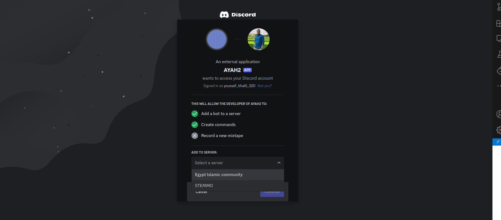

# Menshawy-منشاوي : Islamic Discord Bot 

## Overview

This Discord bot project provides Islamic resources such as Hadiths, Ayahs from the Quran, and Duas (prayers) in response to user queries. It is built using Python and integrates with external APIs for fetching Islamic content. 

## Features
Random Hadiths: Fetches random Hadiths from various books using the api 
```bash
https://api.hadith.gading.dev/
```

Random Ayahs: Retrieves random Ayahs from the Quran with Tafseer using APIs
Quran API
```bash
https://api.alquran.cloud/v1/ayah/
```

tafseer Elsaadi using API
```bash
http://api.quran-tafseer.com/tafseer/3/
``` 

Random Duas: Provides random Duas (prayers) from a local JSON file (prayers.json).

## Usage

### Step 1: Create a Virtual Python Environment

First, create a new virtual environment to ensure all dependencies are isolated from your main Python installation.

```bash
conda create -n ayah-bot python=3.9 
```

### Step 2: Activate the Environment

```bash
conda activate ayah-bot
```

### Step 3: Install the Requirements

```bash
pip install -r requirements.txt
```

### Step 4: get the token from the portal 
To use this application, you need to obtain an Toke key  from [Discord developer portal](https://discord.com/developers/applications). Once obtained, follow these steps:

#### create Application 
press New Application


press New Application and Give it a name


Go to Bot and Reset the Token and copy it 


Go to QAuth2 and from OAuth2 URL Generator choose bot


From Bot permissions choose send messages


copy the URL 


Paste the URL in any browser and choose the server you want to add the bot to



Authorize the bot


### Step 5: Run the app
```bash
python main.py
```

### Demo
1- Ayah and its tafsir from Elsaadi Tafsir


2- Hadith 


3- Duaa from Quran and sunah


4- when the bot get a command he does not know 


## Contribution
Contributions are welcome! If you find any issues or have suggestions for improvement, please create an issue or submit a pull request on the project's GitHub repository.


